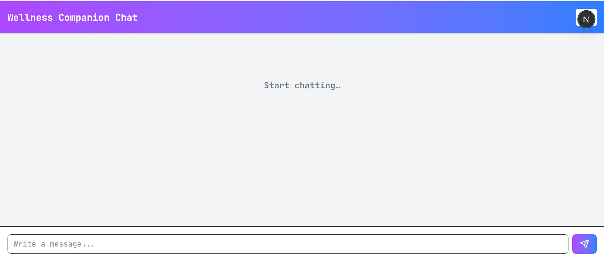
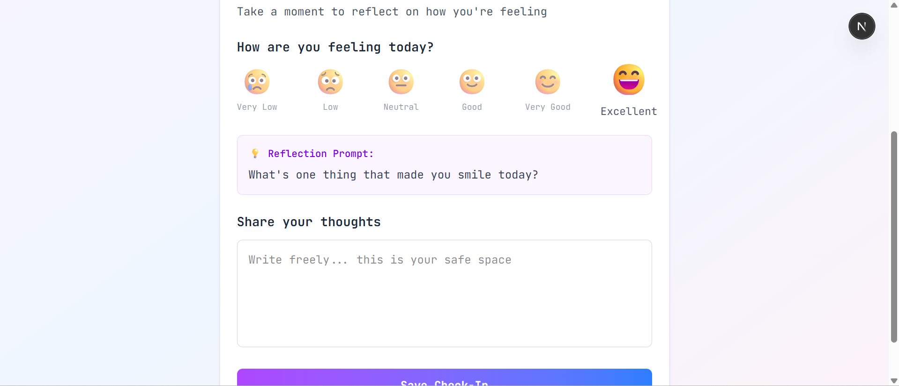
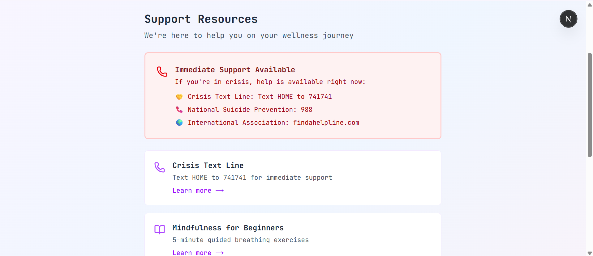
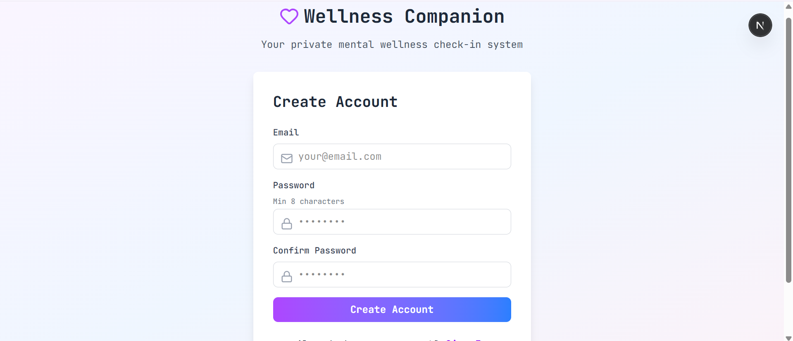
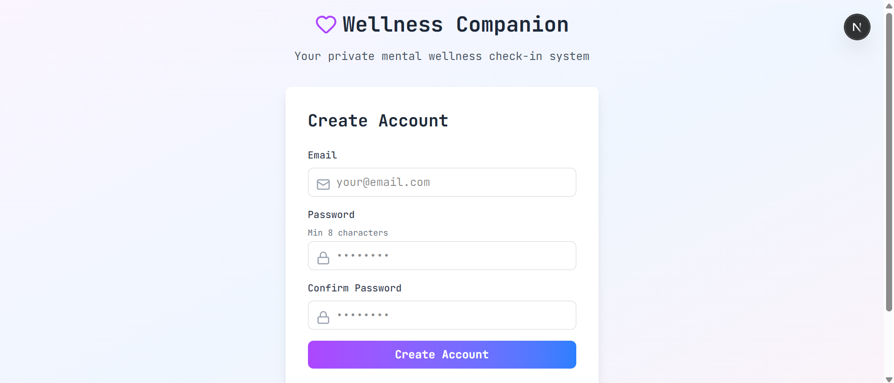

# 🌱 Wellness Companion

A compassionate digital companion for daily mental health check-ins, insights, and early intervention.

---

## 💡 Inspiration
The gap between occasional therapy and daily mental health support is vast and dangerous. Many people struggle silently, only reaching out when they're in crisis. We envisioned a compassionate digital companion that meets users where they are—daily, without judgment, and without the clinical barriers of traditional therapy.

---

## 📝 What It Does

### Daily Wellness Check-In
- Simple mood tracking (0–5 scale with emojis)  
- Guided journaling prompts that encourage reflection  
- Non-clinical, conversational language  
- Takes less than 5 minutes  

### Pattern Detection & Insights
- Tracks mood trends over 7–14 day periods  
- Detects concerning downward trends automatically  
- Generates personalized insights about emotional patterns  
- Alerts users **before** issues escalate (early intervention)  

### Personalized Coping Strategies
- Context-aware suggestions based on current mood  
- Breathing exercises, gratitude practices, movement ideas  
- Evidence-based wellness techniques  
- Different strategies for different mood levels  

### Smart Resource Recommendations
- Crisis hotlines (Crisis Text Line, 988, international resources)  
- Mindfulness & self-help articles  
- Professional therapy resources  
- Curated based on user's current emotional state  

### Privacy-First Design
- End-to-end encrypted data storage  
- User controls all sharing (optional trusted contacts)  
- No forced data collection  
- GDPR-compliant architecture  

### Gentle Reminders
- Non-intrusive notification system  
- Customizable reminder frequency  
- Encouraging (not pushy) language  
- Respects user autonomy  

---

## 🛠️ How We Built It

### Frontend Architecture
**Tech Stack:** Next.js 14 + React 18 + Tailwind CSS + Lucide React  

**Components:**
- `AuthApp.jsx` – Authentication system (Sign Up/Sign In)  
- `WellnessApp.jsx` – Daily check-in interface with mood selector  
- `Dashboard.jsx` – Mood history and pattern visualization  
- `ResourcesPage.jsx` – Curated wellness resources  
- `StatsPage.jsx` – Personal wellness insights  

**Features:**
- Server-side rendering safe (no localStorage errors)  
- Beautiful gradient UI with compassionate design language  
- Responsive design (mobile-first)  
- Real-time form validation  
- Smooth state management with React hooks  

### Backend Architecture
**Tech Stack:** FastAPI + SQLAlchemy + SQLite + JWT + bcrypt  

**API Endpoints:**
- **Auth Routes:**  
  - `POST /auth/register` – User registration with password hashing  
  - `POST /auth/login` – JWT token generation  
  - `GET /auth/me` – Current user info  

- **Wellness Routes (Protected):**  
  - `POST /wellness/checkins` – Create new check-in  
  - `GET /wellness/checkins` – Get user's check-in history  
  - `GET /wellness/checkins/:id` – Get specific check-in  
  - `DELETE /wellness/checkins/:id` – Delete check-in  
  - `GET /wellness/stats` – Get mood statistics & trends  

- **Health:**  
  - `GET /health` – Server status  
  - `GET /` – API info  

**Security Features:**
- Password hashing with bcrypt  
- JWT tokens with 30-minute expiration  
- CORS properly configured  
- Input validation with Pydantic  
- SQL injection prevention via ORM  
- User data isolation (each user sees only their data)  

### Database Design
**SQLite (scalable to PostgreSQL)**  

**Tables:**
- `users`:  
  - id (primary key)  
  - email (unique)  
  - hashed_password  
  - created_at  
  - is_active  

- `check_ins`:  
  - id (primary key)  
  - user_id (foreign key)  
  - mood (0–5)  
  - journal (text)  
  - date (indexed for fast querying)  

---

## ⚡ Challenges We Ran Into
- **localStorage not defined (SSR issue)** → Fixed with `typeof window !== 'undefined'` checks and `useEffect`.  
- **CORS errors** → Added comprehensive CORS middleware in FastAPI.  
- **JWT validation & authorization** → Implemented custom dependency injection with `Depends(get_current_user)`.  
- **Password security** → Used bcrypt hashing, enforced minimum length, never stored plain passwords.  
- **Mood pattern detection** → Compared averages of recent vs older check-ins to detect trends.  
- **Sensitive UX** → Used warm language, emojis, and inviting UI design.  

---

## 🏆 Accomplishments
- ✅ Full-stack implementation (frontend + backend + database)  
- ✅ Production-ready code with error handling and validation  
- ✅ Compassionate design with judgment-free language  
- ✅ Smart features: trend detection, coping strategies, privacy controls  
- ✅ Proper project structure with RESTful API design  
- ✅ Delivered within hackathon timeframe  

---

## 📚 What We Learned
- Mental health tech requires compassion, not just features  
- Privacy is a requirement, not an add-on  
- Early intervention > crisis response  
- Debugging SSR issues requires different thinking than traditional React  
- Documentation saves future developers time  

---

## 🚀 Getting Started

### Prerequisites
- Node.js 18+  
- Python 3.10+  
- SQLite (or PostgreSQL for scaling)  

### Frontend Setup
```bash
cd frontend
npm install
npm run dev

## Screen Shots







## Teammates 
- Sajid Hameed (hameedsajid027@gmail.com)
- Adan Shahid ( adanshahid.student@gmail.com )